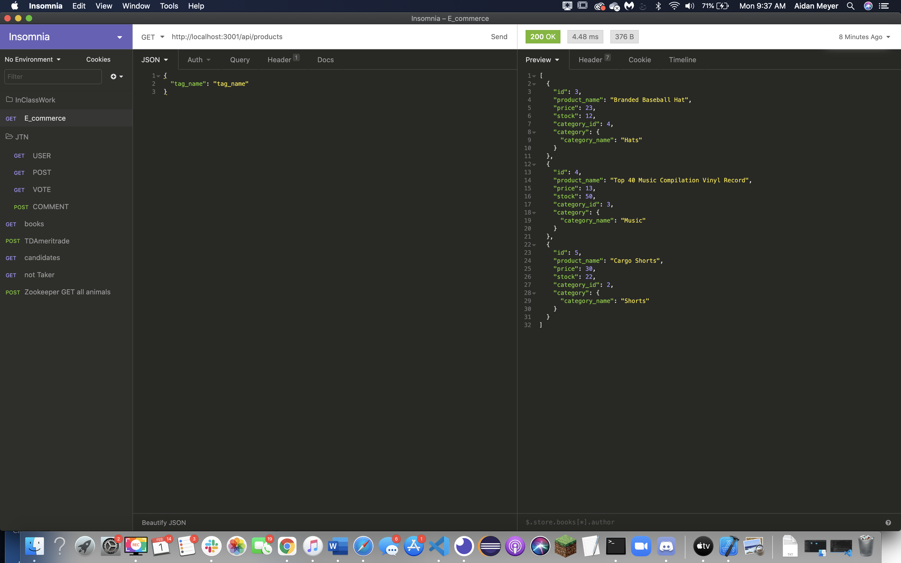

# E-Commerce

## Description 
This project is used to help an online store keep track of its products

## Installation
run npm i, log into your mysql and run source schema, then run npm run seed, and finally npm start to activate the server

## Contact
[Github](https://github.com/XXLZopes)

contact me vie email at afordm99@gmail.com
